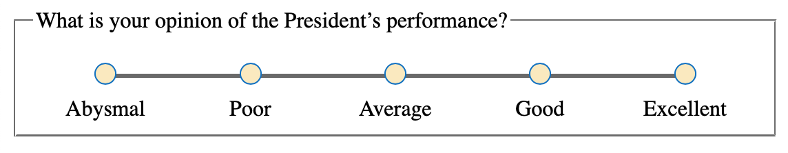

React Likert Scale
======================================

A React component that makes a Likert Scale for collecting data or to make a survey. It has the
following features:

  * it is fully responsive (looks great on laptops and phones)
  * has a very small size (less than 4kb)
  * has zero-dependencies
  * the styling can be customized by providing your own CSS styles

## See the [demo](https://codepen.io/craig-creeger/full/WNGaJxe).




## Installation

`npm i react-likert-scale`


## Usage

```javascript
import React from 'react';
import Likert from 'react-likert-scale';

export default () => {
  const likertOptions = {
    question: "What is your opinion of the President’s performance?",
    responses: [
      { value: 1, text: "Abysmal" },
      { value: 2, text: "Poor" },
      { value: 3, text: "Average", checked: true },
      { value: 4, text: "Good" },
      { value: 5, text: "Excellent" }
    ],
    onChange: val => {
      console.log(val);
    }
  };
  return (
    <Likert {...likertOptions} />
  )
}
```

### Likert Props

#### Required `props`

* `responses` — (array of objects) These are the radio button options. The `value` key is what is
  returned to the calling application in the `onChange` callback. `text` is what’s shown on-screen.
  The optional `checked` key will pre-check a radio button when set to `true`.

#### Semi-required `props`

Technically, these are all optional, however you need to pass in an `onChange` prop if you want to be notified about which option a user chose.

* `onChange` — (callback function) Optionally, you can provide a callback function that returns the
  value of the option that was clicked.

For accessibility reasons, each likert scale on your page needs a unique identifier. If you are
passing in a `question` prop and each question is unique, then that text will be used to generate a
unique identifier. On the other hand, if you are not using `question` or the question text is
duplicated across multiple likert scales, you will need to pass in an `id` prop.

* `question` — (string) This is the prompt that displays above the options. The easiest way to
  create these likert scales is by passing in your question text in this prop, however if you want a
  more custom layout then you can omit this prop. You can see a [grid layout example on
  Codepen](https://codepen.io/craig-creeger/pen/mdOOdjK) that uses this technique.
* `id` - (string) It is your responsibility to pass in a unique ID. If you are using the `question`
  prop it is safe to omit this `id` prop.

#### Optional `props`

* `layout` (string) This controls the position of the Question text. Valid values are `auto` (the
  default) and `stacked`. Auto-layout will position the question text and likert scale on the same
  line when there is enought horizontal space. If the screen is too narrow the question will appear
  above the likert scale. Set `layout='stacked'` if you always want the question to appear above the
  likert scale.
* `flexible` (boolean|integer) This controls the type of layout. When `flexible` is set to `true`,
  which is the default setting, the radio buttons will stretch to fill available space. The question
  text will get positioned to the left of the radio buttons when there is plenty of space, otherwise
  it will appear above the radio buttons. Set `flexible` to `false` if you want the radio buttons to
  use a minimum amount of space at all times. _Passing in an integer is an advanced use-case and frankly isn’t of much value. See the source code for more info. The integer is used as a `flex-grow` value._
* `className` (string) You can use this to apply custom CSS. You class name will be put on a
  `<fieldset>` element, which is the top-level element of this component.
* `ref` (React ref) For advanced use-cases, you may need a reference to the DOM element itself. Pass
  in a [React ref](https://reactjs.org/docs/refs-and-the-dom.html).
* DOM attributes such as `id`, `disabled`, `data-*`, `onClick`, etc. These will get applied to a `<fieldset>` element.


## FAQ

### How do I change colors or other CSS styling?

The top-level DOM element that gets created by this component is `<fieldset class="likertScale">`.
You can override any styles by prefixing your rule with `fieldset.likertScale`. For example, let’s
say you want the radio button “dots” to have a light gray background with a dark green ring.

```
fieldset.likertScale .likertIndicator {
  border: thin solid darkGreen;
  background-color: lightGray;
}
```

You can pass in a `className` prop to the Likert component that can also be used for styling. Refer to the [custom styling example on Codepen](https://codepen.io/craig-creeger/pen/WNGaJxe).

### I need access to the DOM element created by React. How is that done?

This isn’t very common, but you may want to set focus on a Likert Scale after the page renders. This
is done with React via `refs`. Either create your ref with `React.createRef()` or the `useRef()`
hook. You can then pass your `ref` to the Likert component.

```javascript
import React, { useRef } from 'react';
import Likert from 'react-likert-scale';

export default () => {
  const likertOptions = {
    question: "What is your opinion of the President’s performance?",
    responses: [
      { value: 1, text: "Abysmal" },
      { value: 2, text: "Poor" },
      { value: 3, text: "Average" },
      { value: 4, text: "Good" },
      { value: 5, text: "Excellent" }
    ]
  };

  const likertRef = useRef();

  return (
    <Likert {...likertOptions} ref={likertRef} />
  )
}
```

### Can I pass in DOM attributes such as `id`, `class`, `disabled`, `data-*`, `onClick`, etc.?

Sure. They will be applied to the likert component’s top-level DOM element, `<fieldset>`.

```javascript
<Likert {...likertOptions}
  id='Q1'
  className='myClass'
  onClick={() => {
    doThis();
    andThis();
  }}
/>
```

### It doesn’t work. What now?

Let me know. [Create an issue](https://github.com/Craig-Creeger/react-likert-scale/issues) on
GitHub.
