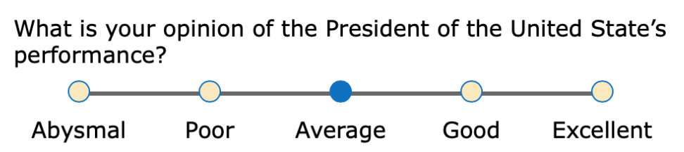

React Likert Scale
======================================

A React component that makes a Likert Scale for collecting data or to make a survey. It has the
following features:

  * it is fully responsive (looks great on laptops and phones)
  * has a very small size (less than 4kb)
  * has zero-dependencies
  * the styling can be customized by providing your own CSS styles



> A live [demo is on CodePen](https://codepen.io/craig-creeger/full/WNGaJxe).

## Installation

`npm i react-likert-scale`


## Usage

```javascript
import React from 'react';
import Likert from 'react-likert-scale';

export default () => {
  const likertOptions = {
    question: "What is your opinion of the President’s performance?",
    responses: [
      { value: 1, text: "Abysmal" },
      { value: 2, text: "Poor" },
      { value: 3, text: "Average", checked: true },
      { value: 4, text: "Good" },
      { value: 5, text: "Excellent" }
    ],
    onChange: val => {
      console.log(val);
    }
  };
  return (
    <Likert {...likertOptions} />
  )
}
```

### Likert Props

This component has three `props`:
* `question` — (string) This is the prompt that displays above the options. It is optional.
* `id` - (string) You are highly encouraged to always pass in a unique ID. This is used primarily
  for accessibility reasons (to associate the label to the radio button). If you are using the
  `question` prop and all you questions are unqiue then it is safe to omit the `id` prop.
* `responses` — (array of objects) These are your options. The `value` key is what is returned to
  the calling application in the `onChange` callback. `text` is what’s shown on-screen. The optional
  `checked` key will pre-check a radio button when set to `true`.
* `onChange` — (callback function) Optionally, you can provide a callback function that returns the
  value of the option that was clicked.


## FAQ

### How do I change colors or other CSS styling?

The top-level DOM element that gets created by this component is `<fieldset class="likertScale">`.
You can override any styles by prefixing your rule with `fieldset.likertScale`. For example, let’s
say you want the radio button “dots” to have a light gray background with a dark green ring.

```
fieldset.likertScale .likertIndicator {
  border: thin solid darkGreen;
  background-color: lightGray;
}
```

### I need access to the DOM element created by React. How is that done?

This isn’t very common, but you may want to set focus on a Likert Scale after the page renders. This
is done with React via `refs`. Either create your ref with `React.createRef()` or the `useRef()`
hook. You can then pass your `ref` to the Likert component.

```javascript
import React, { useRef } from 'react';
import Likert from 'react-likert-scale';

export default () => {
  const likertOptions = {
    question: "What is your opinion of the President’s performance?",
    responses: [
      { value: 1, text: "Abysmal" },
      { value: 2, text: "Poor" },
      { value: 3, text: "Average" },
      { value: 4, text: "Good" },
      { value: 5, text: "Excellent" }
    ]
  };

  const likertRef = useRef();

  return (
    <Likert {...likertOptions} ref={likertRef} />
  )
}
```

### Can I pass in DOM attributes such as `id`, `class`, `disabled`, `data-*`, `onClick`, etc.?

Sure. They will be applied to the likert component’s top-level DOM element, `<fieldset>`.

```javascript
<Likert {...likertOptions}
  id='Q1'
  className='myClass'
  onClick={() => {
    doThis();
    andThis();
  }}
/>
```

### It doesn’t work. What now?

Let me know. [Create an issue](https://github.com/Craig-Creeger/react-likert-scale/issues) on
GitHub.
